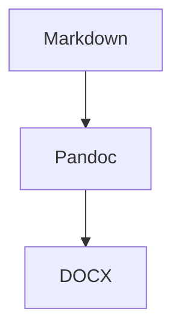

# Overview

This is a sample document for the Markdown to DOCX engine.

## Architecture

## Data Table

| Component | Status | Notes |
| --- | --- | --- |
| Parser | Done | Reads front matter and body |
| Mermaid | Done | Renders SVG and caches by hash |
| Tables | MVP | Supports standard markdown tables |

# Next Steps

This section should start on a new page when pagination is enabled.
