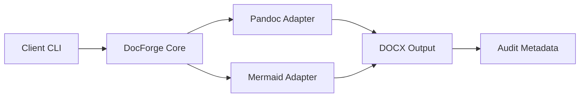
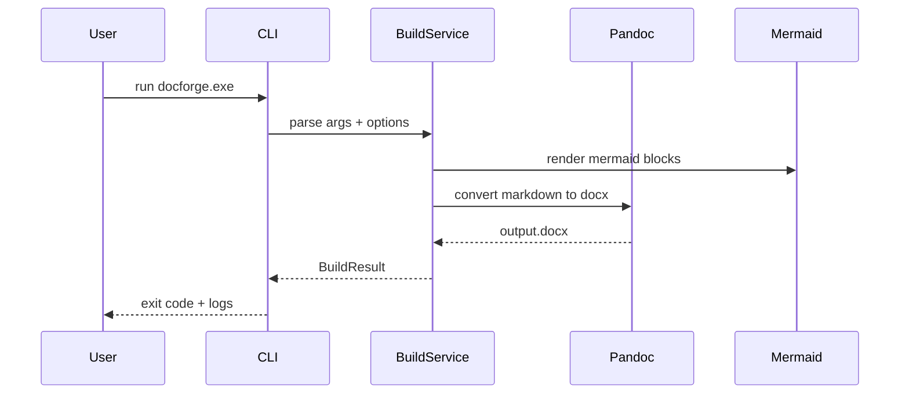

# Executive Summary

This document is intentionally dense to stress test packaged `docforge.exe` behavior.

## Scope

- Multi-level heading numbering
- Multiple Mermaid diagrams
- Long and irregular tables
- Mixed code blocks and inline code
- Warning-triggering table patterns
- Cross references and footnotes

## Quick Checklist

- [x] TOC enabled
- [x] Mermaid enabled
- [x] Page break on H1 enabled
- [x] Standard markdown tables
- [x] HTML table edge cases

# System Architecture

## Context Diagram



## Sequence Diagram



## Component Interface Contract

| Component | Input | Output | Failure Mode | Recoverable |
| --- | --- | --- | --- | --- |
| CLI | argv | BuildOptions | invalid args | yes |
| BuildService | BuildOptions | BuildResult | invalid config | yes |
| Mermaid Adapter | `.mmd` | `.svg` | parse error | no |
| Pandoc Adapter | temp `.md` | `.docx` | tool missing | no |

# Data Processing Rules

## Config Precedence

1. CLI arguments
2. Front matter fields
3. YAML defaults

## Pseudocode

```python
from pathlib import Path

def resolve_template(cli_type, fm_type, cfg_default):
    return cli_type or fm_type or cfg_default


def resolve_reference_doc(reference_doc, base_dir, template_dir=None):
    p = Path(reference_doc)
    if p.is_absolute():
        return p
    if template_dir:
        p1 = Path(template_dir) / p
        p2 = Path(template_dir) / p.name
        return p1 if p1.exists() else p2
    return Path(base_dir) / p
```

## Shell Diagnostics

```bash
./docforge.exe --input examples/stress_tech_high_complexity.md \
  --output output/stress.docx \
  --type tech \
  --template-dir ./templates \
  --verbose
```

# Tables And Edge Cases

## Very Wide Table Row (expected warning)

| id | title | owner | status | details |
| --- | --- | --- | --- | --- |
| 001 | LongRowCase | Platform Team | active | this row intentionally contains a very long cell with many tokens to trigger width warning and wrapping behavior inside docx rendering pipeline for stability verification under constrained page width |

## HTML Table With Rowspan (unsupported by MVP, expected warning)

<table>
  <tr>
    <th>Module</th>
    <th>Case</th>
    <th>Result</th>
  </tr>
  <tr>
    <td rowspan="2">Adapter</td>
    <td>Path Resolution</td>
    <td>Pass</td>
  </tr>
  <tr>
    <td>Binary Detection</td>
    <td>Pass</td>
  </tr>
</table>

## Nested HTML Table (unsupported by MVP, expected warning)

<table>
  <tr>
    <td>
      <table>
        <tr><td>Nested</td></tr>
      </table>
    </td>
  </tr>
</table>

# Performance And Reliability

## Test Matrix

| Test ID | Scenario | Input Size | Mermaid Count | Expected Exit |
| --- | --- | --- | --- | --- |
| T-001 | baseline build | small | 0 | 0 |
| T-002 | full stress | large | 2 | 0 |
| T-003 | mermaid disabled | large | 2 | 0 with warning |
| T-004 | missing pandoc | any | 0 | 2 |
| T-005 | invalid template type | any | 0 | 3 |

## Log Validation Targets

- `logs/build_meta.json` exists
- `logs/SHA256SUMS` appended
- warning codes are emitted for unsupported table patterns

# Security Notes

> Never trust markdown source from untrusted users without sanitization.

1. Validate external image paths.
2. Avoid shell interpolation from document metadata.
3. Keep tool versions pinned for reproducibility.

# Appendix A - API Snapshot

```json
{
  "BuildOptions": {
    "input_path": "Path",
    "output_path": "Path",
    "template_type": "str|null",
    "config_path": "Path",
    "template_dir": "Path|null",
    "enable_mermaid": "bool",
    "verbose": "bool"
  },
  "BuildResult": {
    "exit_code": "int",
    "output_path": "Path|null",
    "warnings": "list",
    "meta_path": "Path|null",
    "sha_path": "Path|null"
  }
}
```

# Appendix B - Footnotes

This is a test reference for footnote rendering.[^footnote1]

[^footnote1]: If this appears correctly in DOCX, footnote conversion is functional.
